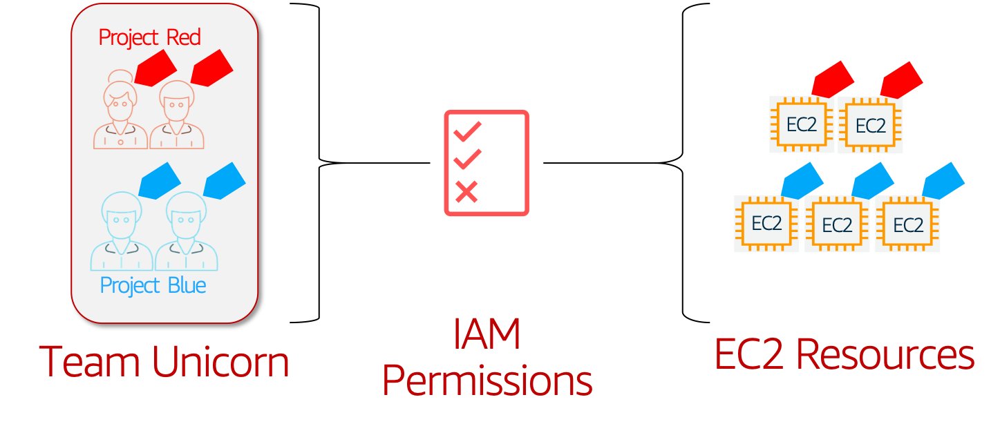

# 👮AWS Security: Restrict EC2 Access based on Tags 🏷 - ABAC

  Attribute-based access control (ABAC) is an authorization strategy that defines permissions based on attributes. In AWS, these attributes are called tags. ABAC allows you the same fine grained access control model like "Role Based Access Control-RBAC", in addition to that you can easily scale your permissions to any number of resources, identities. _[Read More](https://docs.aws.amazon.com/IAM/latest/UserGuide/introduction_attribute-based-access-control.html)_

  

  Follow this article in **[Youtube](https://www.youtube.com/c/ValaxyTechnologies)**

  Our customer has a team of unicorns. They are working on two projects `projectRed` & `projectBlue`. The company has decided to reduce permissions overhead and not write complex policies. The objective is teams should have access to resources from their own projects and nothing else.

- `projectRed`- Will have the following tags.
  - `teamName=teamUnicorn`
  - `projectName=projectRed`

- `projectBlue` Will have the following tags.
  - `teamName=teamUnicorn`
  - `projectName=projectBlue`

1. ## Prerequisites

    This demo, instructions, scripts and cloudformation template is designed to be run in `us-east-1`. With few modifications you can try it out in other regions as well(_Not covered here_).

    - AWS CLI pre-configured - [Get help here](https://youtu.be/TPyyfmQte0U)
    - **Optional** AWS CDK Installed & Configured - [Get help here](https://www.youtube.com/watch?v=MKwxpszw0Rc)

1. ## Environment Setup

    In this repo, I have included a cloudformation template that provisions the resources to setup a fully automatic policy remedation engine.

    - **IAM Group**: `teamUnicorn`
        - _Allows assume role privileges only when member of `teamUnicorn`_
    - **IAM User**: `redRosy` member of `projectRed` part of `teamUnicorn`
    - **EC2 Instances**
      - `projectRed` Web Server
      - `projectBlue` Web Server
    - **IAM Roles**: 
        -  `teamUnicornProjectRedRole` - With condition matching for team and project tags
        -  `teamUnicornProjectBlueRole` - With condition matching for team and project tags

    _**Note**: Sample commands to test the solution can be found in the output section of the cloudformation template_

1. ## Deployment

  You have couple of options to set this up in your account, You can use [AWS CDK](https://www.youtube.com/watch?v=MKwxpszw0Rc) or use the cloudformation template generated by CDK. All the necessary steps are baked into the templates, you can launch it and try it out.

  1. ### Method 1: Using AWS CDK

      If you have AWS CDK installed you can close this repository and deploy the stack with,

        ```sh
        # If you DONT have cdk installed
        npm install -g aws-cdk

        git clone https://github.com/miztiik/attribute-based-access-control-ec2.git
        cd attribute-based-access-control-ec2
        source .env/bin/activate
        pip install -r requirements.txt
        ```

      The very first time you deploy an AWS CDK app into an environment _(account/region)_, you’ll need to install a `bootstrap stack`, Otherwise just go aheadand   deploy using `cdk deploy`

        ```sh
        cdk bootstrap
        cdk deploy
        ```

  1. ### Method 2: Using AWS CloudFormation

      Look for the cloudformation template here: `cdk.out` directory, _From the CLI,_

        ```sh
        aws cloudformation deploy \
            --template-file ./cdk.out/ABAC-EC2.template.json \
            --stack-name "MiztiikAutomationStack" \
            --capabilities CAPABILITY_IAM
        ```

1. ## Testing the solution

    In the `Outputs` section of the cloudformation template we have,

    - `IAM User redRosy` credentials, login url and assume role arn(_link_)
    - `projectRed` WebServer Ip

    This is what, we are going to do now,

    1. Login to AWS Console as `redRosy` user.
    1. Switch Role using the url from the cloudformation
    1. Access EC2 Service
    1. Try to **STOP** `projectBlue` web server - Observe Results
    1. Try to **STOP** `projectRed` web server - Observe Results
    1. Try to **LAUNCH** new web server with tags,
        - `teamName=teamUnicorn`
        - `projectName=projectRed`
    1. Try to **LAUNCH** instane with any other tags
    1. Try to edit tags of other(_non `projectRed`_) instances

    User `redRosy` should be able to manage resources owned by his team `projectRed` only and nothing more. Now that we have confirmed the solution is working, you can extend the solution as required.

1. ## Next Steps: Do Try This

    - Add `Break Glass` Policy
    - Add `teamUnicorn Admin` Role and Privileges
    - Extend to EBS/AMIs etc

1. ## Additional Comments

    Attribute based Access Control is one of the many tools to implement security. Do consider

    - Who has permissions to change IAM Policy permissions?
    - Are you auditing those privileges automatically?
    - If all else fails, do you have mechanisms that will automatically respond to events?


1. ## CleanUp

    If you want to destroy all the resources created by the stack, Execute the below command to delete the stack, or _you can delete the stack from console as well_

    ```bash
    # Delete the CF Stack
    aws cloudformation delete-stack \
        --stack-name "MiztiikAutomationStack" \
        --region "${AWS_REGION}"
    ```

    This is not an exhaustive list, please carry out other necessary steps as maybe applicable to your needs.

## Buy me a coffee

Buy me a coffee ☕ through [Paypal](https://paypal.me/valaxy), _or_ You can reach out to get more details through [here](https://youtube.com/c/valaxytechnologies/about).

### References

1. [IAM policy tags to restrict Access](https://aws.amazon.com/premiumsupport/knowledge-center/iam-policy-tags-restrict/)

1. [Working Backwards: Tags for your AWS resources](https://aws.amazon.com/blogs/security/working-backward-from-iam-policies-and-principal-tags-to-standardized-names-and-tags-for-your-aws-resources/)
1. [Example Policies EC2 ](https://docs.aws.amazon.com/AWSEC2/latest/UserGuide/iam-policies-ec2-console.html)
1. [Specifying Conditions in a S3 Policy](https://docs.aws.amazon.com/AmazonS3/latest/dev/amazon-s3-policy-keys.html#bucket-keys-in-amazon-s3-policies)
1. [AWS Services That Work with IAM](https://docs.aws.amazon.com/IAM/latest/UserGuide/reference_aws-services-that-work-with-iam.html)
1. [AWS Security Blog](https://aws.amazon.com/blogs/security/)

### Contribute

We accept contributions from the community. To submit changes:

1. Fork this repository.
1. Create a new feature branch.
1. Make your changes.
1. Submit a pull request with an explanation of your changes or additions.

We will review and work with you to release the code.

### Metadata

**Level**: 300
